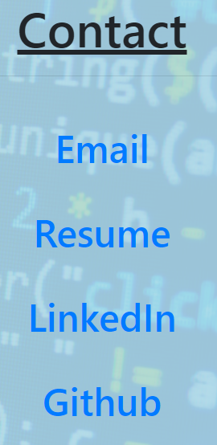

# Portfolio

## About

* This is a personal portfolio, which contains a breif description of myself, in terms of my techinical skills and breif history of my education. This is all done in the "About" page.

## Portfolio

* This page displays group projects and homeworks I worked on during my certificate program at University of Pennsylvania.

* Each item displayed on the page contains a link to the actual application.

## Contact

* This page simply contains links to my personal email, resume, LinkedIn, and Github.

